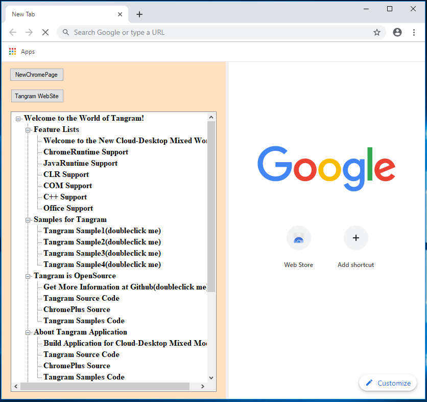
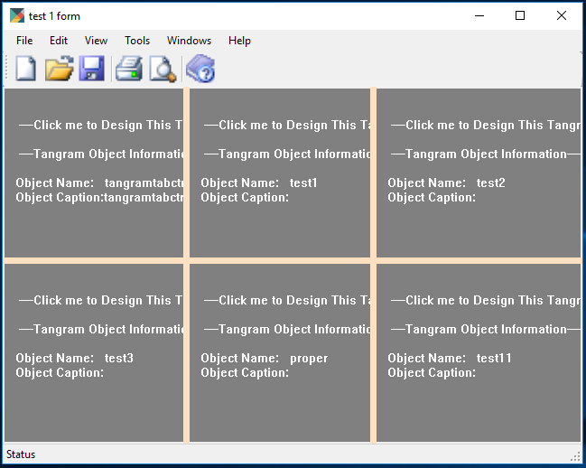

# Tangram Cloud-Desktop Application

[](https://gitter.im/TangramDev/Lobby?utm_source=badge&utm_medium=badge&utm_campaign=pr-badge)

Traditional desktop development has accumulated rich assets for so many years. In the face of the increasingly powerful cloud infrastructure, desktop development urgently needs a new software construction model to better utilize the advantages of the cloud. Tangram helps developers build a new Cloud-Desktop application. It deploys desktop components to the cloud and organizes and presents them using HTML.

## How to work?

[Video from Vimeo]

## Technology architecture

Tangram is based on three open source projects: chromium, eclipse, corefx. The Chromium is built into every application so that every application has all the features of a browser. Moreover, by extending the HTML model in chromium, developers can organize desktop technology components by writing special HTML tags. To enable HTML to support Java and .NET components, Tangram leverages the core technologies of eclipse and corefx to allow .NET and Java to work together in the one process.

## Advantages of Cloud-Desktop application

Cloud-Desktop application deploys the assembly of desktop applications to the cloud. With cloud infrastructure, applications can be better managed, scheduled, and distributed. Cloud-Desktop application follows the existing web development process to organize applications through HTML. It also leverages existing desktop technologies to enable developers to build applications based on desktop technology and web technology.

## Screenshots

[Screenshot]

## Quick Start

Prerequisites:

- Windows 10
- Visual Studio 2017 or 2019
  - Desktop development with C++
  - .NET desktop development

Download and unzip **[ChromeAppSDK.zip](<https://github.com/TangramDev/Tangram/releases>)** to a location of your choice. The directory structure should look similar to:

```
C:\src\ChromeAppSDK
λ ls -la
total 27438
drwxr-xr-x 1 codemeow 197121        0 Jun 14 16:27 ./
drwxr-xr-x 1 codemeow 197121        0 Jun 14 16:27 ../
drwxr-xr-x 1 codemeow 197121        0 Jun 14 16:27 74.0.3729.108/
-rwxr-xr-x 1 codemeow 197121    89600 Jun 14 14:54 chromeapp.exe*
-rw-r--r-- 1 codemeow 197121      184 Jun 14 14:54 chromeapp.exe.config
-rw-r--r-- 1 codemeow 197121      108 Jun 14 14:54 chromeapp.exe.tangram
-rw-r--r-- 1 codemeow 197121     6269 Jun 14 14:54 chromeapp.htm
-rw-r--r-- 1 codemeow 197121    40033 Jun 14 14:54 chromeapp.zip
-rw-r--r-- 1 codemeow 197121     6505 Jun 14 14:54 defaultntpdata.xml
-rwxr-xr-x 1 codemeow 197121  1825280 Jun 14 14:54 tangramchromecore.dll*
-rwxr-xr-x 1 codemeow 197121   568832 Jun 14 14:54 tangramclr.dll*
-rwxr-xr-x 1 codemeow 197121  2866176 Jun 14 14:54 tangramcore.dll*
-rwxr-xr-x 1 codemeow 197121   338432 Jun 14 14:54 tangraminit.dll*
-rw-r--r-- 1 codemeow 197121 11759616 Jun 14 14:54 tangramsetupx64.msi
-rw-r--r-- 1 codemeow 197121 10553344 Jun 14 14:54 tangramsetupx86.msi
```

This package contains everything you need to develop based on Tangram. It contains a sample program **chromeapp.exe** and the corresponding source **chromeapp.zip**. Before starting development work, you need to install the appropriate installation package, **tangramsetupx64.msi** or **tangramsetupx86.msi**, depending on your application architecture.

Double-click the sample **chromeapp.exe** to show 2 windows. Includes a .NET MDI Form window and a Chromium browser window.



Tangram extends the original chromium browser, allowing you to build a hybrid interface using .NET and HTML. Click on the tree node on the left side of the browser to experience the features of Tangram.



In addition, the hybrid interface can be applied not only to the viewport of the browser, but also to the general .NET Form. It should be noted that this extra MDI Form window is controlled and displayed via HTML.

## Build from scratch

Create a normal .NET Winform application `WindowsFormsApp1` and set build platform target to `x64`. Reference `TangramCLR.dll` from `C:\Windows\Microsoft.NET\assembly\GAC_64\TangramCLR\v4.0_1.0.1992.1963__1bcc94f26a4807a7\TangramCLR.dll`.

Add the following code to replace Winform's default message loop.

```
/// <summary>
/// The main entry point for the application.
/// </summary>
[STAThread]
static class Program
{
	/// <summary>
	/// The main entry point for the application.
	/// </summary>
	[STAThread]
	static void Main()
	{
		Application.EnableVisualStyles();
		Application.SetCompatibleTextRenderingDefault(false);
		// Check if the dependent files is ready.
		if (Tangram.CloudAppSupport)
		{
			// Use the message loop of Chromium to take over the application.
			Tangram.InitCloudApp(false);
		}
		else
		{
			// Use the default message loop.
			Application.Run(new Form1());
		}
	}
}
```

Build and into Output directory and usually the directory structure is as follows:

```
C:\Users\codemeow\source\repos\WindowsFormsApp1\bin\Debug
λ ls -l
total 37
-rwxr-xr-x 1 codemeow 197121  7168 May 31 10:17 WindowsFormsApp1.exe*
-rw-r--r-- 1 codemeow 197121   189 May 31 10:15 WindowsFormsApp1.exe.config
-rw-r--r-- 1 codemeow 197121 26112 May 31 10:17 WindowsFormsApp1.pdb
```

You need to copy all the contents of the **ChromeAppSDK.zip** package to the same directory as the executable (currently WindowsFormsApp1.exe). The directory structure look similar to:

```
C:\Users\codemeow\source\repos\WindowsFormsApp1\bin\Debug
λ ls -l
total 4997
drwxr-xr-x 1 codemeow 197121       0 May 31 10:25 74.0.3729.108/
-rwxr-xr-x 1 codemeow 197121 1852928 May 30 15:01 tangramchromecore.dll*
-rwxr-xr-x 1 codemeow 197121  532480 May 30 15:01 tangramclr.dll*
-rwxr-xr-x 1 codemeow 197121 2339840 May 30 15:01 tangramcore.dll*
-rwxr-xr-x 1 codemeow 197121  338432 May 30 15:01 tangraminit.dll*
-rwxr-xr-x 1 codemeow 197121    7168 May 31 10:17 WindowsFormsApp1.exe*
-rw-r--r-- 1 codemeow 197121     189 May 31 10:15 WindowsFormsApp1.exe.config
-rw-r--r-- 1 codemeow 197121   26112 May 31 10:17 WindowsFormsApp1.pdb
```


## Discussion

- Discuss Tangram on our [Gitter](https://gitter.im/TangramDev/Lobby)
- Visit our forum - https://www.tangram.dev/forum

## Contributing

We think that Tangram is a great idea, but now we are understaffed. We urgently need more developers to participate in our work. If you are interested in changing the world with us, please contact us.
